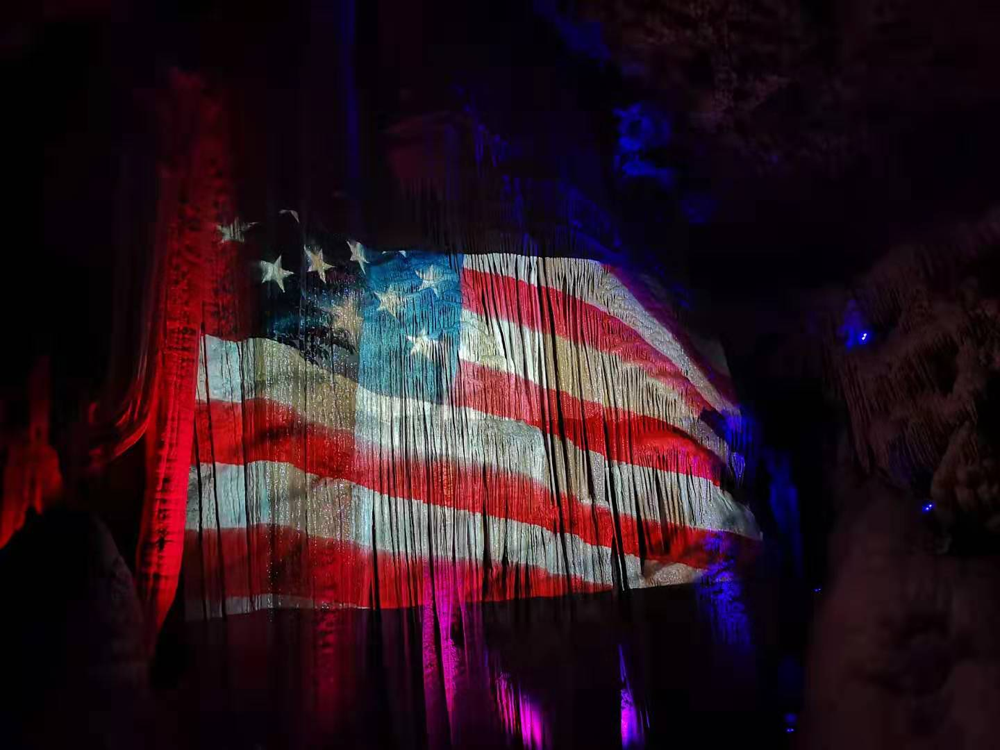
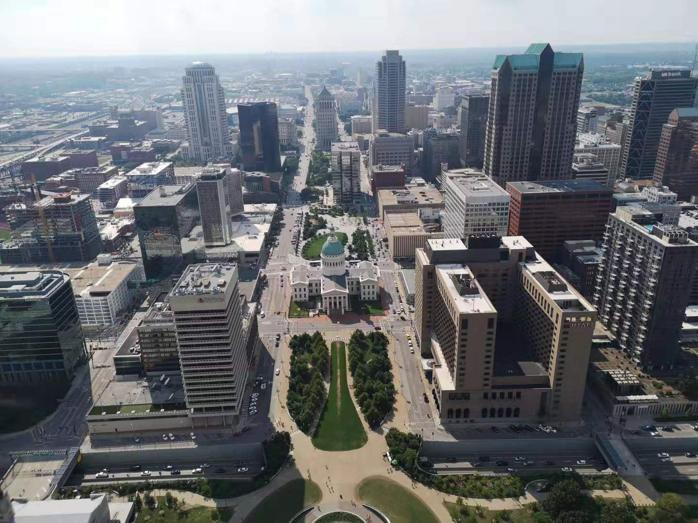
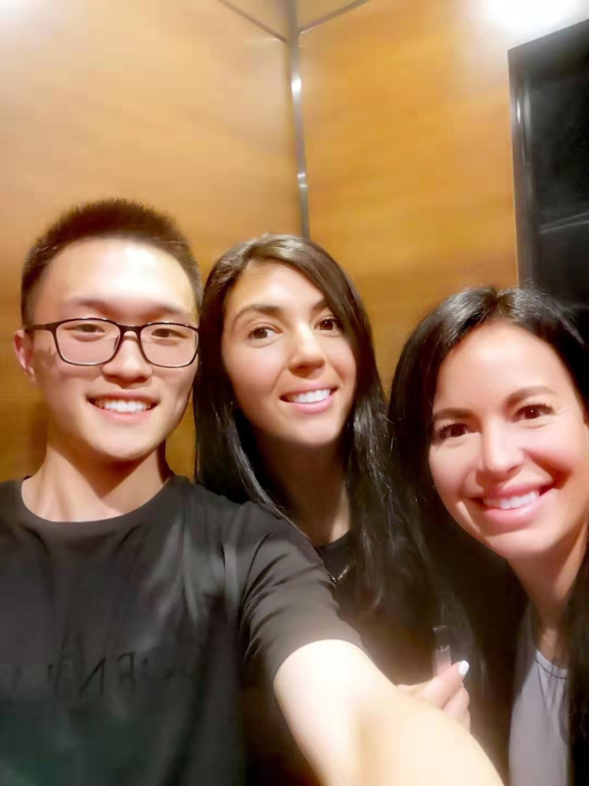
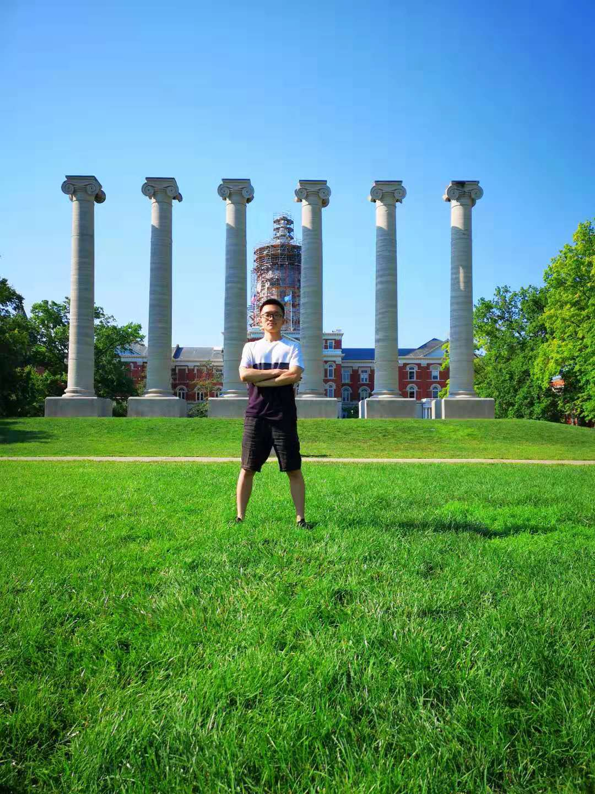
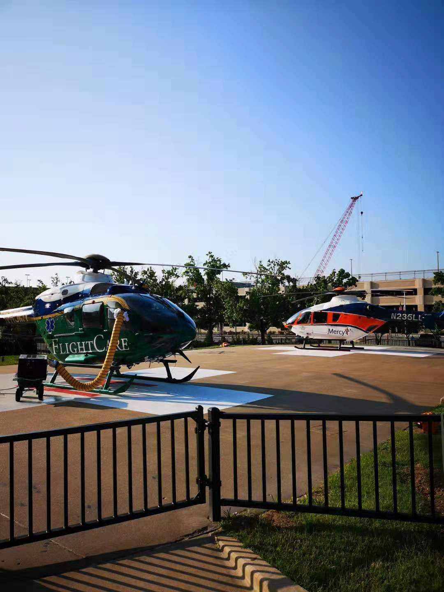
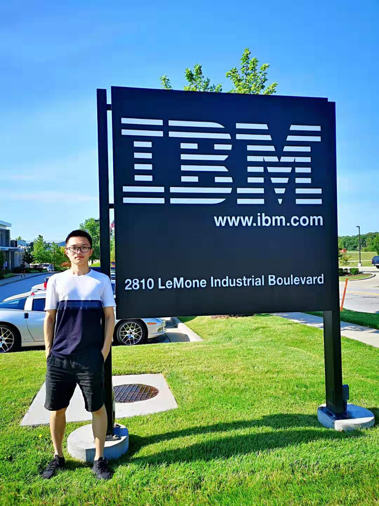
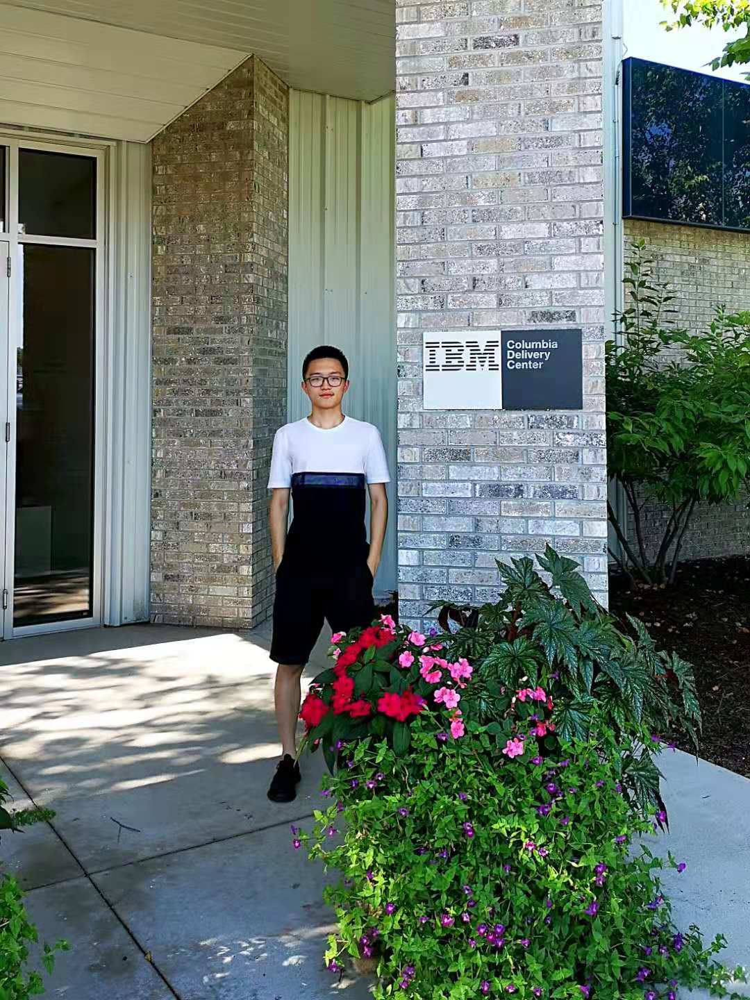
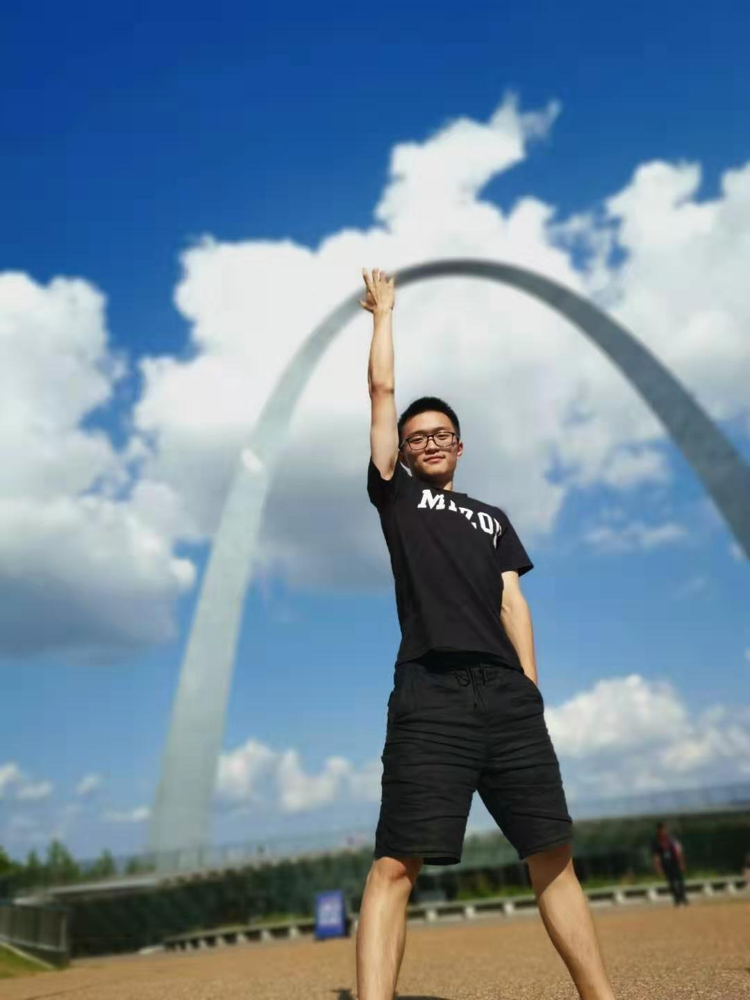
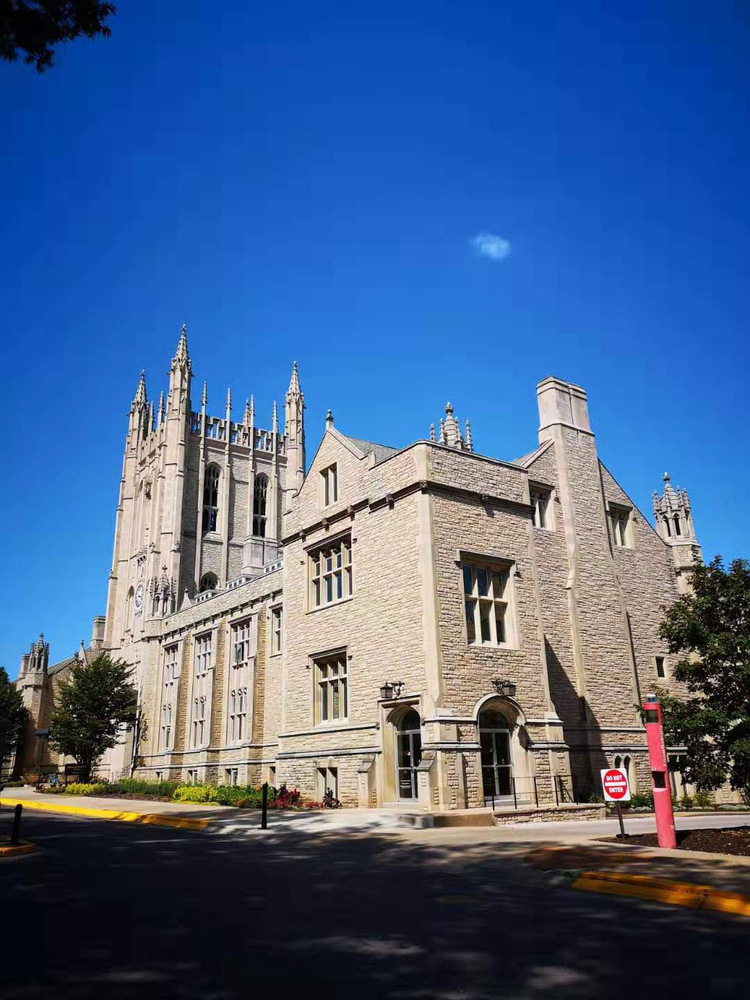
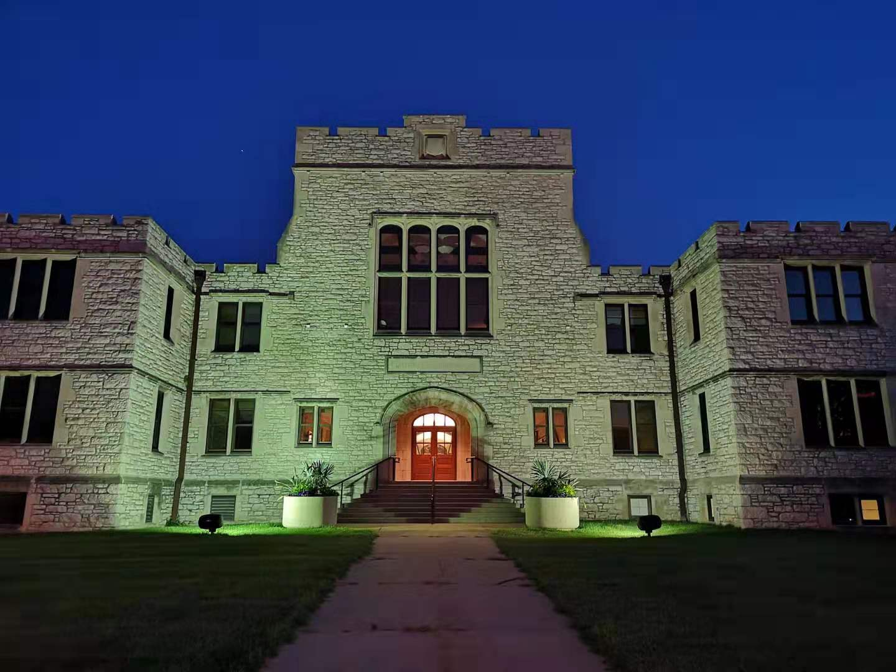

* content
{:toc}

### 美利坚初体验

身为一名土生土长的社会主义青年，从小熏陶在全心全意为人民服务的大环境中，经过12年的小学中学教育，受到高考的残酷洗礼之后，我自信在思想和政治方向是没有错误的。但是“读万卷书不如行万里路，行万里路不如阅人无数”，总是生活在一种单一的社会模式下，对于增长见识开拓视野未必是件好事；偶尔到西方制度模式下体验学习，感受不同文化的熏陶，在未来成长路上也是件好事。

这里就对我这次去美国体验学习的相关情况进行一个简短的总结和记录，对这段时间的自己进行阶段性反思，做到时而“三省吾身”。

第一次跑到地球另一半去，自己在那边生活一个月，收获的感悟还是不少的。大学阶段除了知识和技能的学习训练，更重要的是人格的培养，以及价值观的树立。同行的同学都是来自香港城市大学，上海中医药大学，东北大学等。这次中南大学一共2人参加，我也会分享我的相关经历给其他同学做个借鉴，希望大家有机会也可以体验下美国的风土人情和学习生活。

不是很碰巧，从长沙到北京的航班和北京到达拉斯的航班都有不同程度的延误和取消，但是双方处理方法却截然不同：国内航班只是说了一句天气原因就取消，没有作出任何赔付的举措；而在达拉斯的航班由于延误，机场不仅对我们反复道歉，还对我们的相关损失进行了赔付，详细到包括伙食费，的士费，酒店费等等，我们相当于在达拉斯免费游玩了2天。可以毫不客气地说，美国人真的非常重视服务的质量。

抵达目标学校所在的城市——密苏里州哥伦比亚市后，首先的第一印象是大片大片的绿草，令人心旷神怡；路边的小动物是不怕人的，各种小野兔小松鼠甚至还有麋鹿肆意的穿梭在路边草丛中。天空是湛蓝的，每条街道都一尘不染，民风淳朴环境适宜。

由于密苏里州是美国早期成立时就存在的州，移民比较少，所以相较于其他州民风更加淳朴一些。可以说，这里的美国是最原汁原味的美国。哥伦比亚是围绕在周围大学城建立的一个真正的大学城，这个小城市1/2以上都是本科学历，1/4以上都是研究生学历，所以这个城市的陌生人也普遍非常友善。

学校的新闻学院外的广袤草坪上伫立着的六根巨柱及Jesse Hall是密苏里大学的地标。凡在此地就读过或访学的人似乎都有一张以巨柱和Jesse Hall为背景的照片，如同到了华盛顿要与白宫合影，到了纽约要找自由女神合影，到了旧金山要找金门大桥一样。六根巨柱分别代表着“Respect”“Responsibility”“Discovery”“Excellence”（尊重、责任、探索、卓越），标语清晰务实。

美国的城市基础设施建设非常完善，这与人性化的设施，国民素质密不可分。美国的残疾人生活也非常舒适体面，每栋大楼都有专门的残疾人感应器，卫生间专门有残疾人专用的，电梯也考虑到残疾人而设计的方便安全，甚至每一家医院都配置有专用的医用直升机。大学内的其他设施更是人性化十足：免费上网的电脑，免费饮用的coke，随处可坐的沙发桌椅......整体生活节奏给人舒服放松的感觉，让人生活学习都非常愉快。

与其他体验为主的游学项目不太一样的是，为了让我们更深入的体验到美国大学的教育制度，我们这个Big data summer camp有较多的课程安排，通常上午是3个小时的lecture，下午是3个小时的lab，总体来说比较适合计算机相关专业以及对人工智能感兴趣的同学参加。由于课堂人数较少，所以课堂氛围相对轻松，主要是讨论式教学为主，学生可以任意的表达自己的观点和意见，不会有过多的条条框框拘束，可以让思维得到最大化的开阔。

### 项目中主要学习到的内容包括以下：

1.利用RapidMiner进行可视化的数据挖掘和分析功能，拖拽建模，简单易用，可以大量减轻编程的任务量。

2.学习Hadoop分布式系统架构，通过分布处理和并行计算来处理PB级别数据，其中分为HDFS(Hadoop Distributed File System)和MapReduce，分别为海量数据提供存储和计算。

3.Spark是专为大规模数据处理而设计的快速通用的计算引擎，是Hadoop MapReduce的通用并行框架，拥有MapReduce所具有的优点，同时为Java/python/scala等语言都提供了接口。

4.通过Google Colab平台练习机器学习入门应用，并在项目结束前进行分组汇报展示，最终我们选择了kaggle平台上的Predict Future Sale来做一些Featuring Engineering和模型优化的工作。

### 课余收获

除了课堂学习之外，课余时间学校组织我们参观了位于学校附近都IBM数据中心，IBM德国分公司的网络工程师和软件开发工程师通过远程语音视频的方式，为我们详细的讲解了IBM近年来在IOT和Autonomous Driving等领域取得的进步和成就，并让我们试用了IBM最新的自动驾驶导航系统。

我们去参观了马克吐温的故居，在密西西比河的游船上享用了午餐，深入体验到美国本土的历史传统和人文氛围；参观了Saint Louis的溶洞，感受到大自然的鬼斧神工；参观了Gateway Arch大拱门，领略了西部大解放/经济繁荣下人们的自豪和骄傲，也切身体会到了中美政治制度上的差异。

在这一系列的文化参观活动中，无论在学校学习、在街头闲逛、在商场购物，在任何地方，我都能感受到美国人的友好和礼貌。刚到美国时，迎面而来的陌生人向我“Good morning”, “How‘s it going”时，我很快就适应了，并且会像他们一样主动热情的和陌生人打招呼。在我看来，从一方面，可以说这是文化习惯，另一方面更可以说这是美国人的一种开放心态的表现。这种开放心态同样体现在所谓的“美国梦”上，这个国家从殖民地到建国再到现在，数百年来，无数人甚至一无所有的人从全世界移民到美国，追寻的就是“美国梦”，即使追寻的是世俗意义上的成功。但恰恰是这种追寻，造就了这个国家文化上的勤劳、竞争、开放和包容，就像奥巴马总统连任成功后在获胜演讲中提到的“I believe we can keep the promise of our founding, the idea that if you're willing to work hard, it doesn't matter who you are or where you come from or what you look like or where you love. It doesn't matter whether you're black or white or Hispanic or Asian or Native American or young or old or rich or poor, abled, disabled, gay or straight. You can make it here in America if you're willing to try.”

然而，盛名之下，其实难副。美利坚也不全是优点，她同样有很多国内不存在的问题和缺点：美国由于人口的限制，造成互联网的应用场景相较国内差之甚远，再加上美国的互联网技术更偏向于研究型而非实用型，所以对于广大创业者来说，国内的机会要远远高于国外。当你设计开发了一款产品，你当然希望能得到丰富的用户反馈来优化其体验，这时你在中国将比在美国有更加广阔的发展前景。

这次赴美国学习不到一个月的时间内，可以说，收获上丰富的，印象上深刻的。美国屹立在世界之巅数百年，自然有值得我们学习/深思/借鉴的东西，这也就是我们在未来需要走的路。相信在不远的未来，中国也可以像美利坚一样，真正走上全民繁荣富强的道路，这正是时代赋予我们这代人的历史使命与时代重任：

> **With great power comes great responsibility.**
