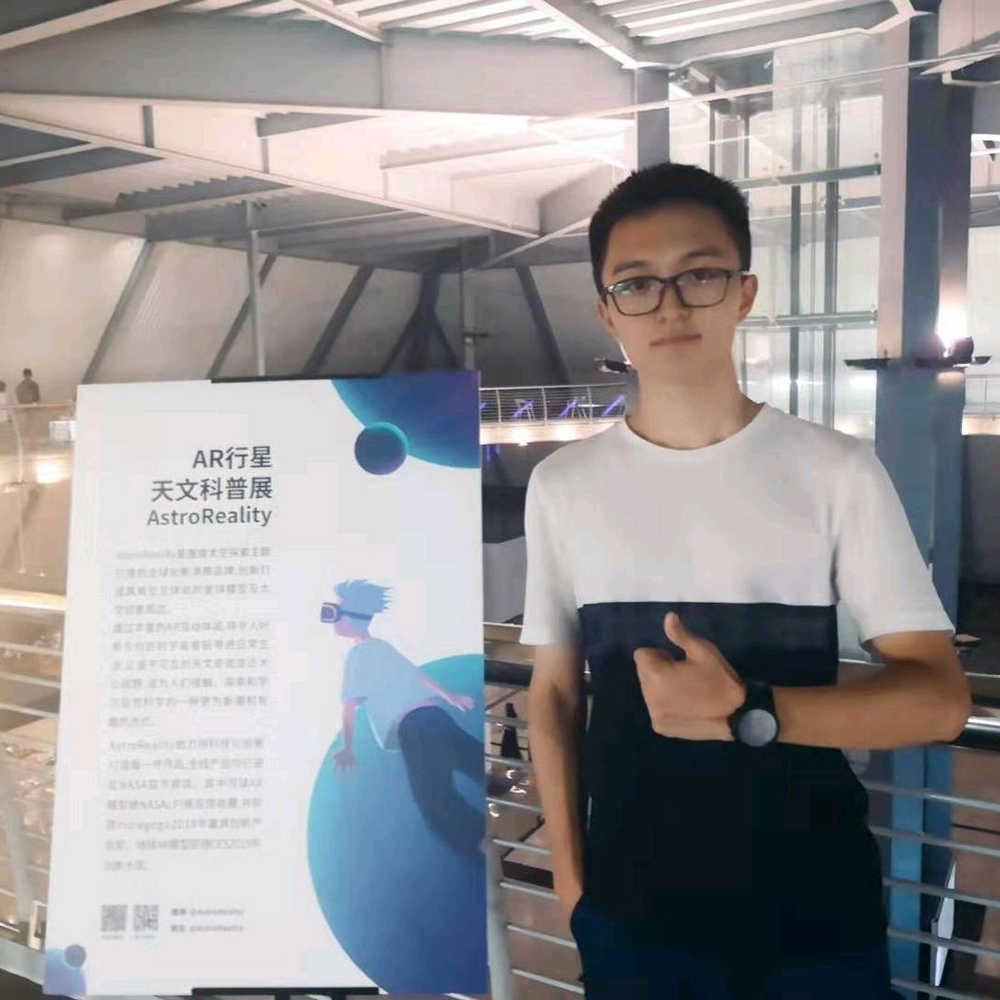
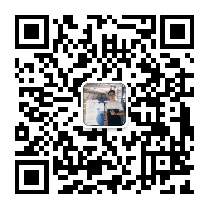

* content
{:toc}

## 关于我

[个人简历](https://drive.google.com/open?id=1L1SCmHD9R0rQM1Zvo3_R811knmnK2ebY)

目前就读于中南大学本科			电子信息工程专业

中南大学智能驾驶实验室做3维雷达点云数据的聚类深度学习

参加2019清华大学GSF Innovation Accelerator获得第3名

参加2019华中HackFun黑客马拉松

参观过阿里、百度、MSRA、网易、搜狐等多家大型互联网公司、AI大厂

曾经对自己的前途和方向一度感到迷茫，没有找到自己读大学的目的何在，但在多位优秀的学长学姐的支持和鼓励之下，我慢慢地找到了方向，对自己的未来有了一个比较明确的规划和发展。

CS这个东西刚接触的时候说实话我也是一脸懵逼，但是经过一段时间的琢磨之后，发现有好多东西都是相通的，只是从不同的路径在走，但最终都会汇集到同一个终点，道法万物就是这个道理。

在CS的路上以后还会越走越远，每一步都有巨大的坑在等着去填，希望我能达到自己的目标！

对我感兴趣的或者是同道中人，欢迎加上我的微信，下面就是我的微信二维码，别忘了写清楚备注信息哦😄

Hello everyone, I’m Chester, you can call me that or my Chinese name Zhang. I’m from Central South University and major in electronic engineering. Used to finish big data project in Missouri University. Now I’m work on data analysis about Autonomous driving. I’m good at machine learning and deep learning model. I’m an Android & iOS developer, and giving speech/lecture is fitting me as well. 

Welcome anyone love tec to add me or comment about me. If you get interested in me, welcome to add my Wechat code, so thst we can communicate more. Thx

## 联系我

* GitHub：[Chester Cheung](https://github.com/zhyChesterCheung)
* email：cheung.zhy.csu@gmail.com / zhy_cheung@csu.edu.cn
* QQ number：2640617395
* [Weibo](http://weibo.com/ChesterCheung)
* [知乎](https://www.zhihu.com/people/ChesterCheung)
* [Facebook](https://www.facebook.com/chester.cheung.3538)
* [Twitter](https://twitter.com/ChesterCheung)

## Comments


